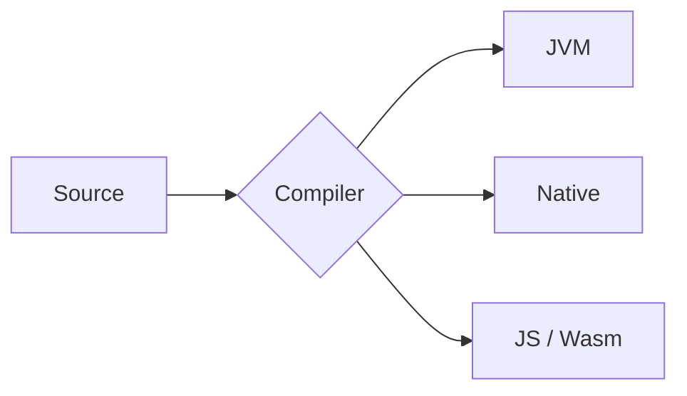

# Docusaurus · Diagrams (Mermaid)

The kit can enable [Mermaid](https://mermaid.js.org/) diagrams themed to the kit's tokens. It's opt-in and needs the official theme package.

```bash
pnpm add @docusaurus/theme-mermaid
```

## Three steps

Two of these are top-level Docusaurus config a preset cannot set for you, so wire them up yourself:

````ts
import { ktMermaidThemeConfig } from '@ktdocs/docusaurus-preset';
import type { Config } from '@docusaurus/types';

const config: Config = {
  // 1. Tell Docusaurus to parse ```mermaid fenced blocks:
  markdown: { mermaid: true },

  presets: [
    [
      '@ktdocs/docusaurus-preset',
      {
        // 2. Add the themed Mermaid theme:
        mermaid: true,
      },
    ],
  ],

  themeConfig: {
    // 3. Apply the kit's Mermaid theme (neutral/dark + kit font):
    mermaid: ktMermaidThemeConfig,
  },
};
````

## Authoring

Then write diagrams in a fenced `mermaid` block:

````md

````

With Mermaid enabled, that renders as an inline diagram themed with the kit's font and neutral/dark palette.

## Tweaking colors

`ktMermaidThemeConfig` sets the diagram font and uses Mermaid's `neutral` (light) / `dark` (dark) base themes. For brand-colored nodes, spread it and add concrete `themeVariables` (CSS variables don't resolve inside Mermaid's color math, so use hex):

```ts
themeConfig: {
  mermaid: {
    ...ktMermaidThemeConfig,
    options: {
      ...ktMermaidThemeConfig.options,
      themeVariables: { primaryColor: '#7F52FF', lineColor: '#6B3DEB' },
    },
  },
}
```
